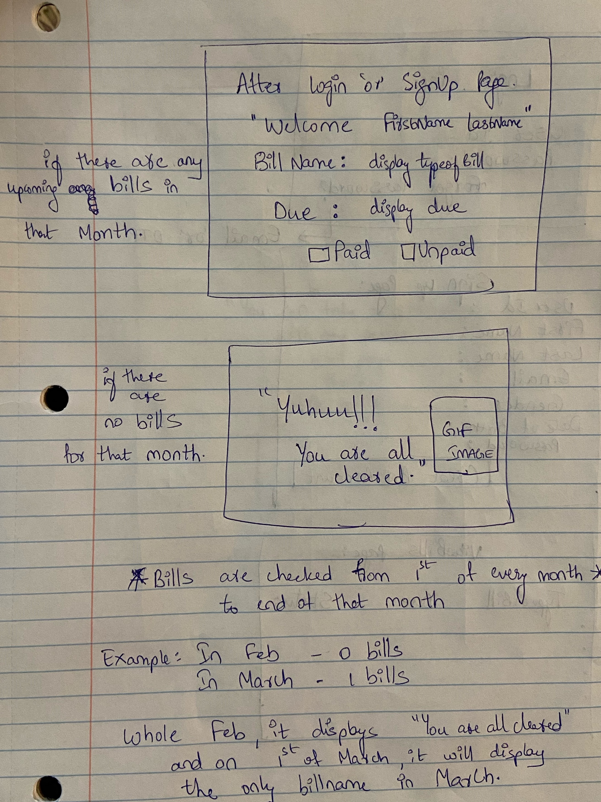
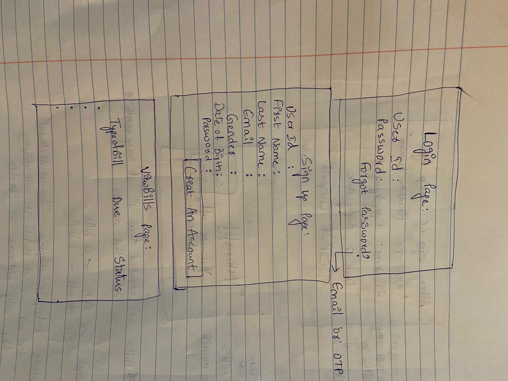
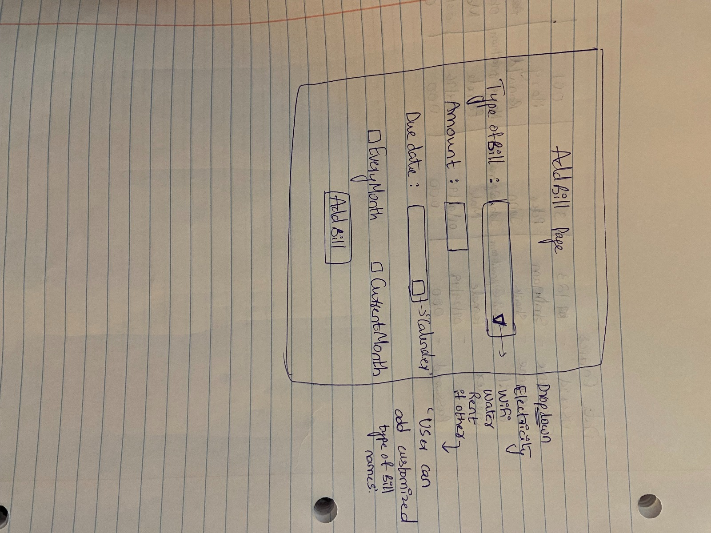

# Bills On Time
# Team Members
Shabnam Shaik - Frontend developer

Gahana Swetha - Backend developer
# Clients
Swarupa Pedapali

Satya Narayana Gullapali
# Statement Of Purpose
# Project Vision
# Stack
Frontend - html with bootstrap framework

Backend - .NET core with c#

Database - Mongo db

Analysis tool - codacy

Deployment - Hereko
# Functional Requirements
User : Our application just have a user with no admin. The user signs up and start adding bills into their account according to their convenience.

# Working & Project Description
Our application, Bills On Time is designed in such way that the user doesn't forget to pay their bills. 
Since the user will already be logged in, the upcoming bill name and date will be displayed on the home page. 
If the user wants to see all the upcoming bills at a time in a month, the user needs to hit on "Continue" button on the bottom of the display.
For updating bills, the user need to click on "addbill" button, which takes the user to calendar, then the user needs to select the following date
which will then navigates the user to mention the type of bill like (electricity,wifi,rent etc.). There's even an option of "if other", 
so that the user can fill in personal bills like dentist bill, amazon bill or any such things. In addition there is recursive option, 
Every Month or Current Month, so that the bills repeat according to the option we select. Thus, the purpose of the application is full filled by 
reminding the users to pay their bills on time.

# ER diagram
 
# UI sketches
## Home page

## Home page after logging_in

## Login SignUp ViewBill pages

## AddBill page

# Screen Flow
# Authentication 
